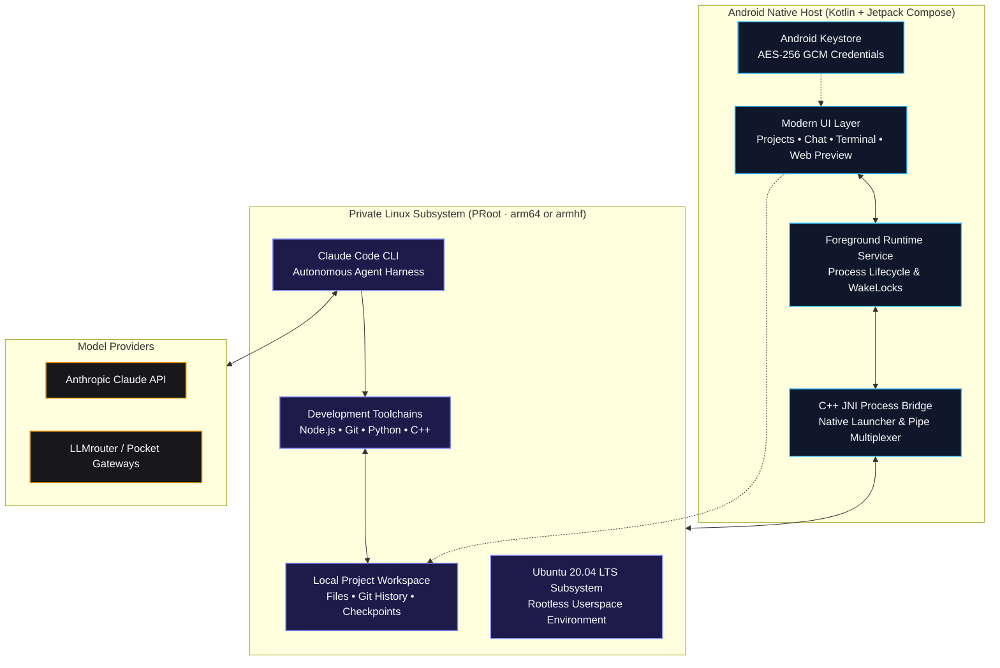

<div align="center">

  

  # Mobile Agent

  ### *The complete autonomous AI development workspace for Android.*

  **Chat with coding agents, edit projects, execute real Linux commands, inspect diffs, and preview live web servers — all directly on your phone.**

  <br />

  [](https://github.com/anonamus-man/Mobile-agent/releases/latest)
  [](#system-requirements)
  [](LICENSE)
  [](docs/32-BIT-SUPPORT.md)

  <br />

  [**Releases**](https://github.com/anonamus-man/Mobile-agent/releases) &nbsp;•&nbsp;
  [**32-bit support**](docs/32-BIT-SUPPORT.md) &nbsp;•&nbsp;
  [**Quickstart Guide**](#quickstart) &nbsp;•&nbsp;
  [**Architecture**](#architecture) &nbsp;•&nbsp;
  [**Build from Source**](#developer-guides)

</div>

<br />

---

<p align="center">
  <a href="https://youtu.be/QzAau52Z7yQ" target="_blank" rel="noopener noreferrer">
    
  </a>
  <br />
  <sub>Walkthrough of the upstream project &nbsp;|&nbsp; <i>Setting up Ubuntu, connecting Claude Code, and building an app on Android</i></sub>
</p>

---

<br />

> [!IMPORTANT]
> **Environment Security Notice**  
> Mobile Agent runs on **ARM64 and ARMv7 (32-bit) Android devices** using a private userspace PRoot layer. While isolated from other apps via standard Android sandbox permissions, PRoot is not a virtualization boundary or hardened security jail. Only execute projects and dependencies you own or trust.

<br />

## Capabilities

Mobile Agent unites modern **Jetpack Compose UI** with a self-contained **Ubuntu 20.04 LTS subsystem**. It gives you a desktop-class software development environment in your pocket without requiring root access, unlocked bootloaders, or external applications like Termux.

<table>
  <tr>
    <td width="50%" valign="top">
      <h3>Autonomous Agent Coding</h3>
      <p>Native integration with Claude Code CLI. Stream step-by-step reasoning, automated file manipulation, and terminal commands across persistent project sessions.</p>
    </td>
    <td width="50%" valign="top">
      <h3>Isolated Linux Subsystem</h3>
      <p>A full Ubuntu 20.04 userspace running inside PRoot — arm64 or armhf, matched to your CPU. Includes Node.js, npm, Git, OpenSSL, and essential shell tooling out of the box.</p>
    </td>
  </tr>
  <tr>
    <td width="50%" valign="top">
      <h3>Instant Web Preview</h3>
      <p>Spun up a Vite, Next.js, or Express server? Test web interfaces in real-time within a restricted, sandboxed mobile WebView with console telemetry.</p>
    </td>
    <td width="50%" valign="top">
      <h3>Keystore-Grade Encryption</h3>
      <p>Your API keys and credentials are encrypted using Android Keystore-backed AES-256 GCM. No telemetry, no remote proxies, and zero plain-text leaks.</p>
    </td>
  </tr>
  <tr>
    <td width="50%" valign="top">
      <h3>Safe Iteration & Checkpoints</h3>
      <p>Review rich visual diffs of agent-authored code. Accept changes, roll back broken states, or branch checkpoints before testing complex edits.</p>
    </td>
    <td width="50%" valign="top">
      <h3>Native File Workflow</h3>
      <p>Browse, edit, search, and attach files directly from the app interface. Interoperate with system storage via Android Storage Access Framework (SAF).</p>
    </td>
  </tr>
</table>

<br />

## Workspace Interface

<table>
  <tr>
    <th width="33%" align="center">Projects</th>
    <th width="33%" align="center">Terminal</th>
    <th width="33%" align="center">Settings</th>
  </tr>
  <tr>
    <td align="center" valign="top">
      
    </td>
    <td align="center" valign="top">
      
    </td>
    <td align="center" valign="top">
      
    </td>
  </tr>
  <tr>
    <td align="center"><sub>Create, organize, and resume isolated workspace sessions.</sub></td>
    <td align="center"><sub>Execute real Linux commands and scripts with instant output.</sub></td>
    <td align="center"><sub>Manage AI providers, installed toolchains, themes, and runtime health.</sub></td>
  </tr>
</table>

<br />

## Quickstart

Get up and running in 3 guided steps:

### 1. Download & Install
Download the latest signed release APK from [GitHub Releases](https://github.com/anonamus-man/Mobile-agent/releases/latest), or build it yourself with the instructions below.

```text
Target Architecture : ARM64 (arm64-v8a) and ARMv7 (armeabi-v7a)
Package Version     : v1.0.2
Minimum OS Level    : Android 9.0 (API 28)
```

> On 32-bit ARM the agent runs the JavaScript build of Claude Code, because
> Anthropic publishes no `linux-arm` native binary. See
> [32-bit support](docs/32-BIT-SUPPORT.md) for the full picture.

<br />

> [!IMPORTANT]
> **On Android 13, 14 and 15 you will see "This app was built for an older
> version of Android".** This is expected. Tap **More details → Install
> anyway** and everything works normally.
>
> Mobile Agent targets API 28 deliberately. Since Android 10, apps targeting
> API 29 or higher [cannot execute files in their own data
> directory](https://developer.android.com/about/versions/10/behavior-changes-10#execute-permission)
> — and the Ubuntu environment, Node.js and Claude Code all live there.
> Targeting 28 is the only way to keep the Linux runtime working. Termux
> targets 28 for exactly the same reason.
>
> <details>
> <summary>If you don't see an "Install anyway" option</summary>
>
> Google Play Protect is blocking the install rather than Android itself.
> Either:
>
> 1. **Play Store → your profile → Play Protect → ⚙️ → turn off "Scan apps with
>    Play Protect"**, install, then turn it back on; or
> 2. Install over ADB from a computer:
>    ```bash
>    adb install mobile-agent.apk
>    ```
>
> Android's own hard install block only applies below API 23, so an API 28
> build is never rejected by the OS itself.
> </details>

### 2. Guided Bootstrap (~10 Minutes)
Launch the application and follow the interactive setup wizard:

<table>
  <tr>
    <th width="33%" align="center">1 · System Readiness</th>
    <th width="33%" align="center">2 · Toolchains</th>
    <th width="33%" align="center">3 · AI Provider</th>
  </tr>
  <tr>
    <td align="center" valign="top">
      
    </td>
    <td align="center" valign="top">
      
    </td>
    <td align="center" valign="top">
      
    </td>
  </tr>
  <tr>
    <td align="center"><sub>Verifies device storage, CPU architecture, and background service permissions.</sub></td>
    <td align="center"><sub>Select core Ubuntu runtime and optional development stacks.</sub></td>
    <td align="center"><sub>Securely store your API keys in Android Keystore.</sub></td>
  </tr>
</table>

### 3. Create & Build
1. Tap **New Project** or launch an instant **Quick Project**.
2. Open the **AI Workspace** and describe what you want to build.
3. Watch the agent inspect files, draft code, run builds, and launch local web previews.

<br />

## Model Providers

Mobile Agent uses Claude Code's Anthropic-compatible API protocol. You can connect official endpoints or route requests through compatible translation proxies:

| Provider | Integration Type | Streaming | Tool Calling | Status | Notes |
| :--- | :---: | :---: | :---: | :---: | :--- |
| **Anthropic API** | Direct Key | Supported | Supported | `Recommended` | Primary supported backend |
| **LLMrouter** | Gateway | Supported | Supported | `Supported` | Anthropic-compatible proxy |
| **Custom API** | Endpoint Override | Compatible | Compatible | `Experimental` | User-configured gateway |
| **OpenAI / Kimi Gateway** | Pocket Adapter | Translated | Translated | `Beta` | Requires protocol adapter |

> [!NOTE]
> All credentials are stored with hardware-backed Android Keystore AES-256-GCM encryption. Keys are decrypted solely in-memory during active bridge operations.

<br />

## Architecture

Mobile Agent bridges native Android Jetpack Compose to an isolated PRoot Linux execution layer via an optimized C++ JNI bridge:



### Core Runtime Components
* **Base Environment**: Ubuntu 20.04 verified rootfs — `arm64` on 64-bit devices, `armhf` on 32-bit
* **Agent Engine**: Official Claude Code CLI from Anthropic — the signed native binary on ARM64, the npm JavaScript build on ARMv7
* **Native Tooling**: Node.js LTS, npm, Git, OpenSSL, curl, and GNU coreutils
* **Process Virtualization**: PRoot user-space architecture emulation with zero kernel modifications

Because PRoot supervises the guest with `ptrace`, the guest userspace must match
the bitness of the app process — a 32-bit tracer cannot drive a 64-bit tracee.
Everything the installer fetches is therefore selected from the detected
architecture; see [`docs/32-BIT-SUPPORT.md`](docs/32-BIT-SUPPORT.md).

<br />

## System Requirements

| Metric | Minimum Specification | Recommended Specification |
| :--- | :--- | :--- |
| **Operating System** | Android 9.0 (API level 28) | Android 13.0+ (API level 33+) |
| **CPU Architecture** | ARM — `arm64-v8a` or `armeabi-v7a` | High-performance 8-Core ARM64 (Snapdragon 8 Gen 1+ / Dimensity) |
| **RAM** | 4 GB on ARM64 · 2 GB on ARMv7 | 8 GB or more |
| **Free Storage** | 2.5 GB (Base Runtime) | 8.0 GB+ (For multi-language toolchains and build caches) |
| **Network** | Stable connection for setup & API | High-speed Wi-Fi during initial rootfs provisioning |

<br />

---

## Developer Guides

<details>
<summary><b>Building from source (Android Studio & NDK)</b></summary>

<br />

### Prerequisites
* **Android Studio**: Ladybug / Hedgehog or newer
* **Android SDK**: API Level 36 (`compileSdk 36`)
* **Java Development Kit**: JDK 17 (Eclipse Temurin or OpenJDK)
* **Android NDK**: `26.1.10909125`
* **CMake**: `3.22.1`

### Clone & Build Debug APK
```bash
# Clone the repository
git clone --recurse-submodules https://github.com/anonamus-man/Mobile-agent.git
cd Mobile-agent

# Build the debug binary for both ARM ABIs
./gradlew assembleDebug

# ...or narrow it to one architecture
./gradlew assembleDebug -PmhAbis=armeabi-v7a

# Deploy directly to a connected test device
adb install -r app/build/outputs/apk/debug/app-debug.apk
```

### Quality Assurance & Testing
```bash
# Run unit tests
./gradlew testDebugUnitTest

# Run static analysis linter
./gradlew lintDebug
```

### Target Profiles
* **Direct Sideload APK** (Default): Targets API 28 to preserve proven userspace execution paths under Android 10-14.
* **Google Play Compliance Build**:
  ```bash
  ./gradlew -PplayBuild=true assembleDebug
  ```
  Refer to the [Google Play Release Checklist](docs/PLAY_STORE_CHECKLIST.md) for signing and permission policies.

</details>

<details>
<summary><b>Optional toolchains and development stacks</b></summary>

<br />

Mobile Agent allows downloading optional developer packs on demand to conserve space:

* **Python Suite**: Python 3.10+, pip, virtualenv, and essential scientific C-extensions.
* **Android & JVM**: OpenJDK 17 headless runtime and Gradle build tools.
* **C / C++ Compiler Suite**: GCC/G++, Clang, Make, and CMake for native tool compilation.
* **PHP Development**: PHP CLI runtime, Composer, and standard database extensions.

> *Note: Kernel-level virtualization technologies such as Docker, KVM, systemd services, and nested hardware emulators are not supported under PRoot.*

</details>

<details>
<summary><b>Repository directory structure</b></summary>

<br />

```text
Mobile-agent/
├── app/src/main/
│   ├── java/com/sid/agent/
│   │   ├── data/       # Preferences, Keystore AES encryption, SQLite persistence
│   │   ├── model/      # Data entities: Projects, Chats, Diffs, Tool calls
│   │   ├── runtime/    # PRoot installer, C++ agent bridge, foreground services
│   │   └── ui/         # Jetpack Compose screens, Material 3 theme, ViewModels
│   ├── cpp/            # Native C++ launcher, pseudo-terminal pipe handler
│   ├── assets/         # Verified rootfs checksums, licenses, base configuration
│   └── res/            # Android icons, XML drawables, vector assets
├── fastlane/           # Play Store metadata, graphics, and release automation
└── docs/               # In-depth architectural notes & Play Store review guides
```

</details>

<details>
<summary><b>Security model and data privacy</b></summary>

<br />

* **Zero Cloud Intermediaries**: Mobile Agent connects your device directly to your chosen AI endpoint. No intermediate relays or telemetry servers collect your prompts or code.
* **Scoped Storage**: Project imports and exports utilize Android's official Storage Access Framework (SAF) instead of broad shared storage access.
* **Cryptographic Checksums**: Root filesystem archives and Claude Code packages are verified before extraction — SHA-256 for Ubuntu/Node.js/Anthropic downloads, and the registry SHA-512 integrity hash for the npm tarball used on ARMv7.
* **Encrypted Secrets**: API tokens are encrypted in hardware-backed storage via Android Keystore.

Read our complete [Privacy Policy](PRIVACY.md).

</details>

<br />

## Current Limitations

* **Architecture**: ARM only (`arm64-v8a`, `armeabi-v7a`). x86/x86_64 devices and emulators are not supported.
* **32-bit agent version**: ARMv7 devices run the last Claude Code release that shipped a JavaScript entry point, so the agent trails the ARM64 build. [Details](docs/32-BIT-SUPPORT.md).
* **Process Isolation**: PRoot maps file systems and IDs in user space; it is not a cryptographically hardened container or VM.
* **Terminal Emulation**: The process bridge handles standard CLI workflows and REPLs; specialized ncurses applications may experience minor layout artifacts.
* **OS Process Management**: Heavy compilation workloads may be throttled if Android applies aggressive battery optimization. It is recommended to exempt Mobile Agent from battery optimization in device settings.

<br />

## Legal & Trademarks

* Mobile Agent is an independent open-source project and is not affiliated with, endorsed by, or sponsored by Anthropic.
* **Claude** and **Claude Code** are trademarks of Anthropic, PBC. Claude Code CLI is downloaded directly from Anthropic's official distribution endpoints during setup and remains governed by Anthropic's license terms.
* Ubuntu, Android, Kotlin, Node.js, Git, and other registered trademarks belong to their respective copyright holders.
* Third-party open-source licenses are compiled in [`app/src/main/assets/licenses`](app/src/main/assets/licenses).

<br />

## License

This project is licensed under the [MIT License](LICENSE). Third-party runtime binaries and packages remain governed by their respective upstream licenses.

<br />

---

<div align="center">
  <sub>Crafted for developers who want a serious, uncompromised development environment wherever they go.</sub>
  <br />
  <sub>Released under the MIT licence. See <a href="LICENSE">LICENSE</a>.</sub>
</div>

---

## Credits

Mobile Agent is a fork of [**Mobile Harness**](https://github.com/techjarves/Mobile-Harness)
by [TechJarves](https://github.com/techjarves), released under the MIT licence and
retained in [`LICENSE`](LICENSE). This fork adds 32-bit ARM (`armeabi-v7a`) support —
see [`docs/32-BIT-SUPPORT.md`](docs/32-BIT-SUPPORT.md) — and the walkthrough video
above is the upstream project's.

Bundled third-party components keep their own licences:
[PRoot](https://github.com/termux/proot) (GPL-2.0),
[libandroid-shmem](https://github.com/termux/libandroid-shmem) (BSD-3-Clause),
and [talloc](https://talloc.samba.org/) (LGPL-3.0-or-later).
